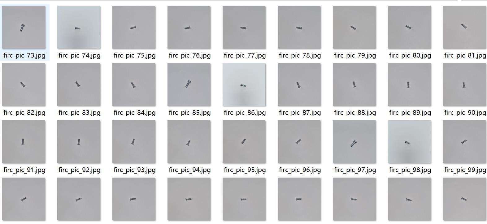
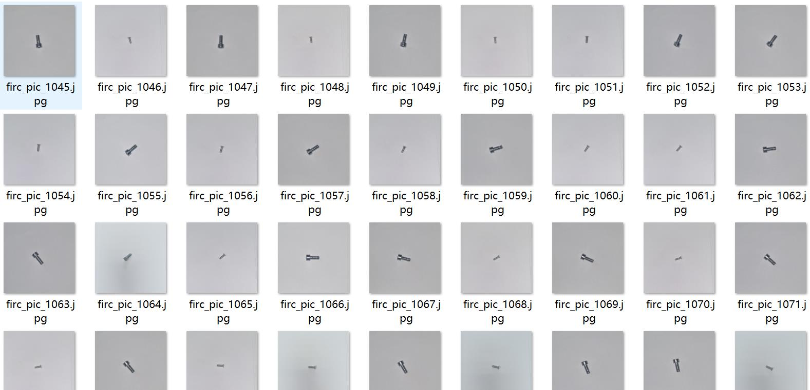
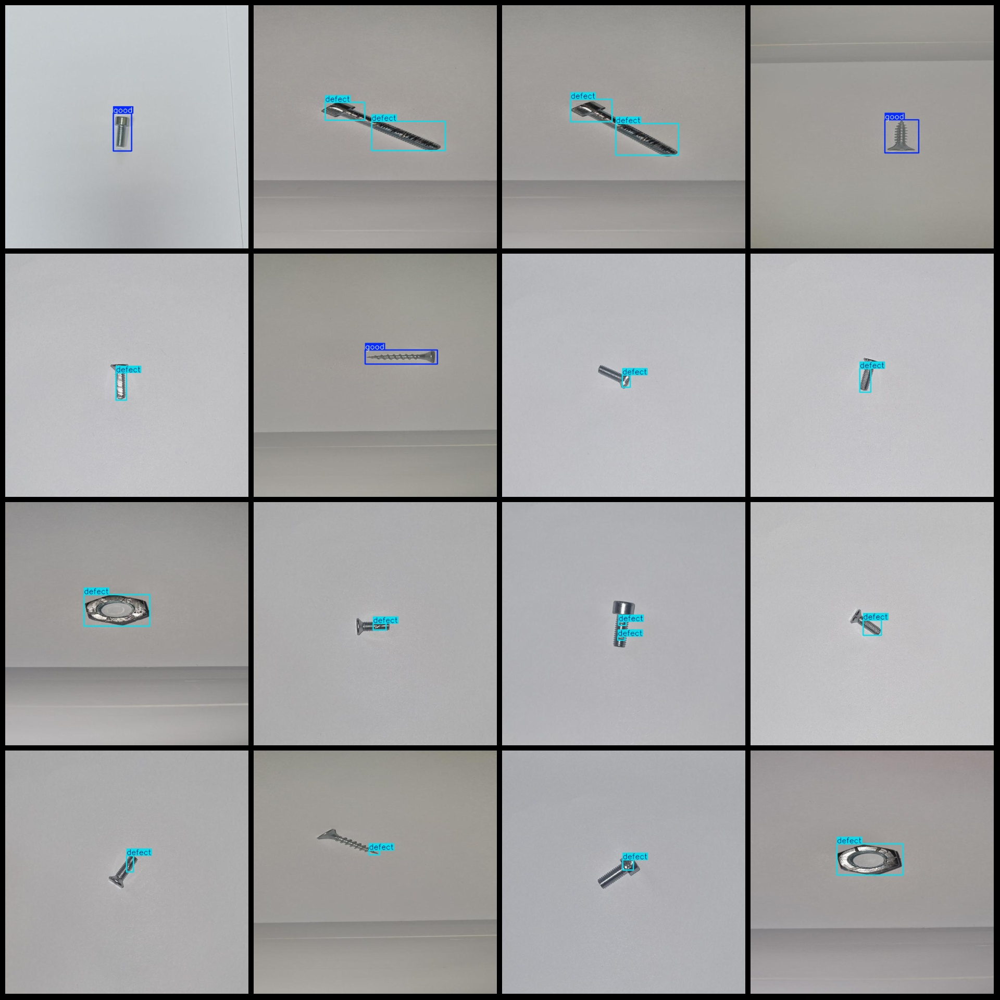
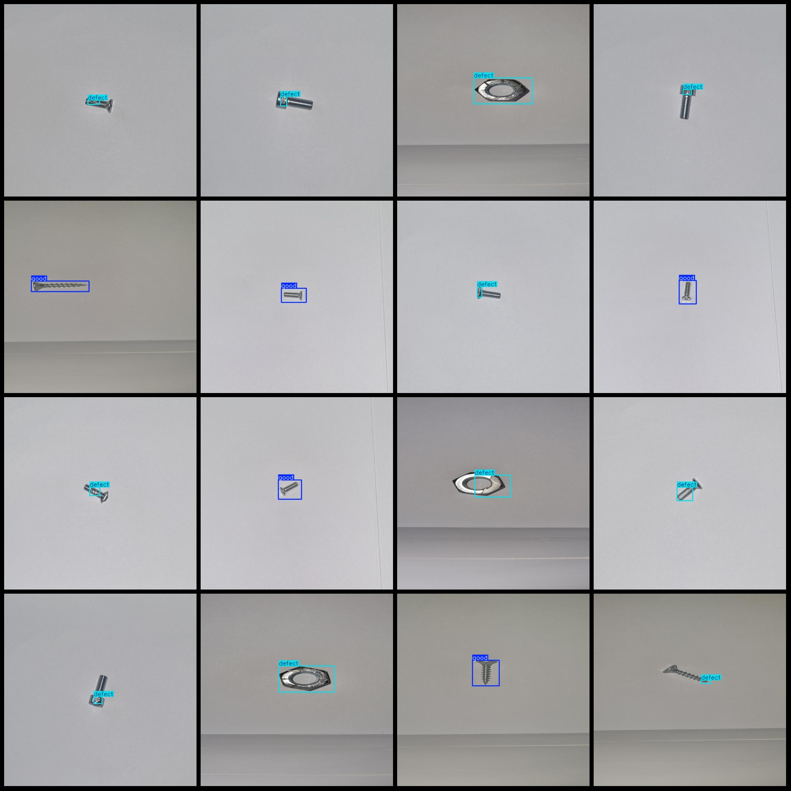

# Screw and Nut Defect Detection Dataset VOC+YOLO Format with 1108 Images in 2 Categories

Dataset format: Pascal VOC format + YOLO format (without split path in txt file, only containing jpg image and corresponding VOC format xml file and yolo format txt file)
The number of images (number of jpg files): 1108
annotation count: 1108  
The quantity marked in the txt file is 1108.
annotationnumber of classes: 2  
Annotation class names (Note that the order in the Yolo format does not correspond to this, but is based on the labels file's classes.txt): ["defect", "good"]
boxes per class:   
defect box count = 1077  
To solve the problem, we need to find the number of good frames in a sequence where each frame is represented by a "good" value. The given frame count is 236, which can be interpreted as the total number of frames in the sequence.

The formula to calculate the number of good frames is:

$ \text{Number of good frames} = \frac{\text{Total number of frames}}{\text{Good value per frame}} $

Substituting the given values into the formula:

$ \text{Number of good frames} = \frac{236}{2} $

This simplifies to:

$ \text{Number of good frames} = 118 $

Therefore, there are 118 good frames in this sequence.
total boxes: 1313  
images per class:   
The number of defective images is 872.
"Good occupancy rate = 236"
image resolution: 640x640  
Using the labeling tool: labelImg
Annotation rules: Draw a rectangle around the class.
Important notes: The dataset does not have separate training, validation, and test sets. Please partition them yourself.
Special statement: This dataset does not guarantee the accuracy of the trained model or weight file.
Preview of the image:
Annotation example:
## Images

Here is a pay link on Stripe ( https://buy.stripe.com/3cs8yP7sY87d0vu9AB ). Please contact me lonlonago@foxmail.com after funding $89, and I will send you a complete data files , thank you!

